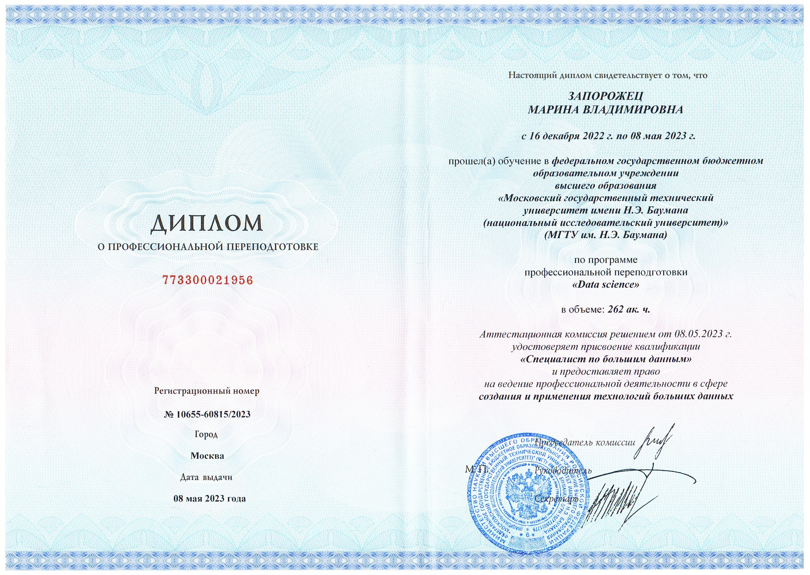
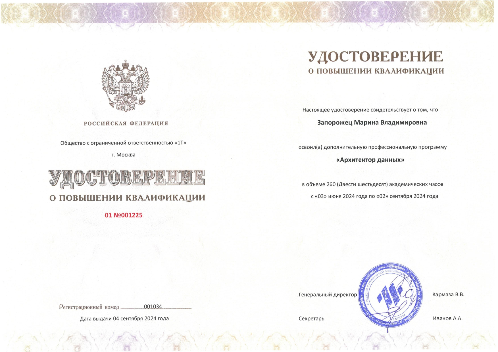
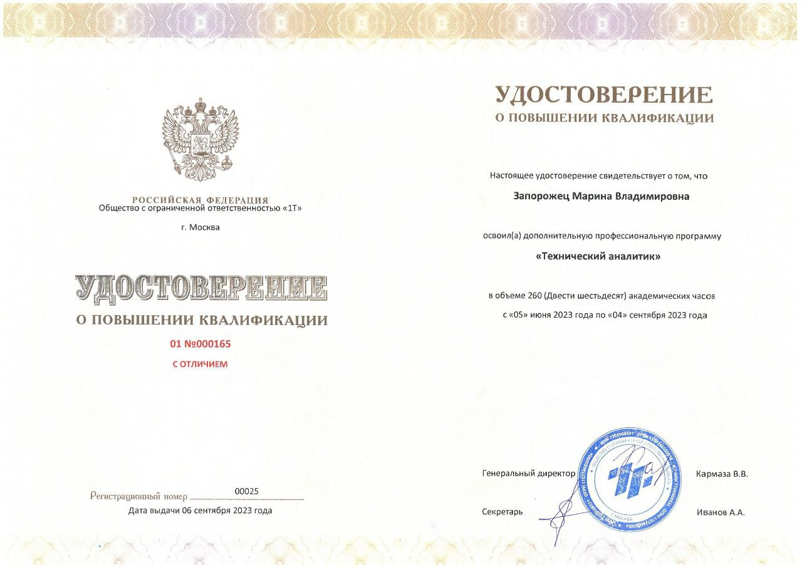
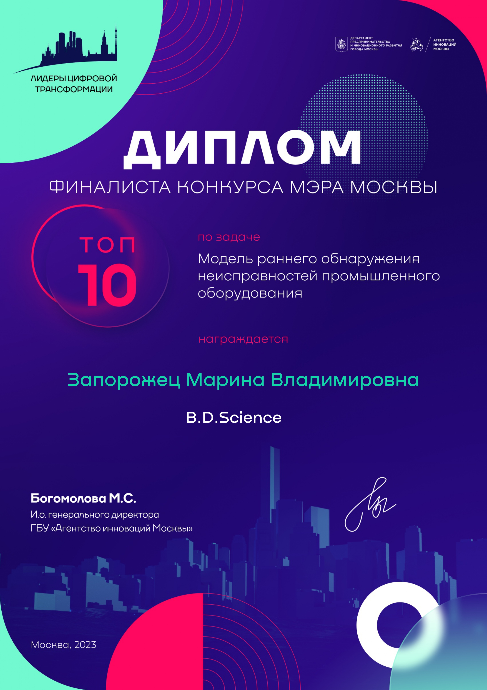

<h2 align="center">
   Привет, я Марина!
</h2>

<!-- Анимация с эффектом печати -->

  

**Data Engineer | DevOps Engineer**, специализируюсь на проектировании и автоматизации **масштабируемых ETL/ELT-пайплайнов**, построении **надёжной инфраструктуры на облачных платформах (AWS/GCP)** и внедрении **CI/CD-процессов для data-приложений**. Уверенно работаю с оркестрацией задач, контейнеризацией, мониторингом и развёртыванием ML-моделей.

---

<!-- Статистика GitHub -->

  

  
  

  
  

---

---

## 🛠️ Мой Tech Stack

### ☁️ Cloud & Platforms

### 🛠️ DevOps & CI/CD

### 🗄️ Data Engineering

### 📝 Languages & Tools

### 🔌 Backend & APIs

### 🖥️ Operating Systems

### 📚 Methodologies & Collaboration

---

## 💼 Опыт и Достижения

**ООО "1Т"** — *Data Engineer / DevOps Engineer*  
*Июнь 2023 — Декабрь 2023 - обучениие и стажировка в компнии*
*Декабрь 2023 — август 2024 - трудоустройство в компании*

**Обязанности:**
- Разработка и поддержка ETL/ELT-пайплайнов с использованием **Apache Airflow**.
- Контейнеризация и развёртывание сервисов (включая LLM) с помощью **Docker и docker-compose**.
- Оркестрация задач и управление конвейерами данных (DAGs).
- Настройка **CI/CD** для автоматической доставки кода, бэкапов БД и сборки контейнеров.
- Администрирование Linux-серверов (Ubuntu), настройка безопасности и мониторинга.
- Работа с **Prometheus и Grafana** для мониторинга производительности.
- Проектирование и оптимизация **PostgreSQL** и **ClickHouse**.
- Реализация **REST API на FastAPI** с валидацией (Pydantic), асинхронной обработкой (Uvicorn) и интеграцией с Hugging Face.
- Репликация данных через **Debezium + Kafka + Zookeeper**.
- Оптимизация производительности: кэширование, GPU-ускорение, логирование и безопасность (токены).
- Командная работа по **SCRUM**, ведение документации в **Confluence**.

**Дополнительно:**
- **TeamLead** стажёрской команды по направлению DevOps.
- **Младший преподаватель** на курсах [data.1t.ru](https://data.1t.ru) (курс "Архитектор данных").

---

---

[//]: # ()
[//]: # (## 📊 Моя Статистика на GitHub/GitLab)

[//]: # ()
[//]: # ([![Your Name's GitHub Stats]&#40;https://github-readme-stats.vercel.app/api?username=mazavlia&show_icons=true&theme=radical&#41;]&#40;https://github.com/mazavlia&#41;)

[//]: # ([![Top Langs]&#40;https://github-readme-stats.vercel.app/api/top-langs/?username=mazavlia&layout=compact&theme=radical&#41;]&#40;https://github.com/mazavlia&#41;)

[//]: # ()
[//]: # (---)

[//]: # (## 📌 Избранные проекты)

[//]: # ()
[//]: # (Здесь разместите 3-5 своих самых крутых проекта с описанием и технологиями.)

[//]: # ()
[//]: # (- **[Project Name]&#40;link-to-repo&#41;]** - Краткое описание что это и зачем. `Python` `Terraform` `Kafka`)

[//]: # (- **[Another Project]&#40;link-to-repo&#41;]** - Еще одно описание. `K8s` `ArgoCD` `Helm`)

[//]: # ()
[//]: # (---)

## 📜 Diplomas & Certificates

Click on the preview to open the full document:

  
  
  
  
  

## 📜 Other docs

  
  

> 🔍 *All previews are clickable. Files are stored locally in `./pictures/`.*